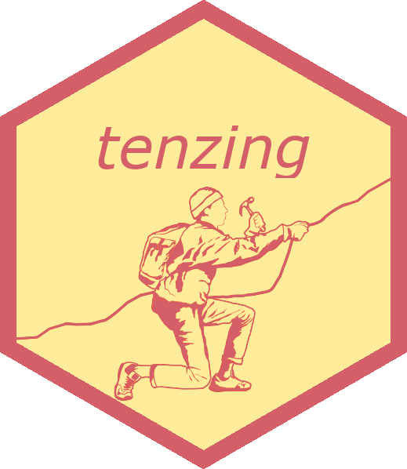

<!-- README.md is generated from README.Rmd. Please edit that file -->

# tenzing <a href='https://marton-balazs-kovacs.github.io/tenzing/'></a>

<!-- badges: start -->

[](https://lifecycle.r-lib.org/articles/stages.html#stable)

<!-- badges: end -->

An easy-to-use web app for researchers, tenzing generates
reports about the contribution of each team member on a project using
CRediT. Researchers typically paste these reports into their journal manuscripts. JATS-XML can also be generated, for publishers to
incorporate into article metadata.

[CRediT](http://credit.niso.org/) (Contributor Roles Taxonomy) is a
taxonomy of 14 categories of contributions to scientific scholarly
output. Each researcher can indicate which category they contributed to
in a scholarly project.

Tenzing is a Shiny app programmed with R. There is also an R package version.

Tenzing is named after the Nepali-Indian Sherpa Tenzing Norgay, who was
one of the two individuals who reached the summit of Mount Everest for
the first time. Despite his essential contribution, he received less
credit than his partner, the New Zealand mountaineer Edmund Hillary.

## Features

Tenzing can:

-   read all the necessary contributorship information from one file
    (.csv, .tsv or .xlsx)
-   create a report of the contributions
-   create the contributors’ affiliation information, designed for
    inclusion in the first page of a manuscript
-   create JATS XML with the contributions, suitable for publishers to
    include in metadata
-   create a YAML output that will automatically add the contributorship
    information to the `papaja`package used by some researchers to write
    APA-formatted manuscripts

## Usage

Tenzing can be used either via the web app or via R.

### Using the web app

You can use the app at <https://tenzing.club/>.

You can alternatively run the app locally on your own computer by
following these instructions:

Install the development version (tenzing is not available from CRAN)
from [GitHub](https://github.com/) with:

``` r
# install.packages("devtools")
devtools::install_github("marton-balazs-kovacs/tenzing")
```

Running the app.

``` r
tenzing::run_app()
```

You can read more on how to use the `tenzing` app in
`vignette("app_use")`.

### Using the package

You can read more on how to use the `tenzing` package to create reports
from R in `vignette("local_use")`.

## Contribution

We are open to new ideas and feature requests. You can see already-requested features [in the Github Issues](https://github.com/marton-balazs-kovacs/tenzing/issues?q=is%3Aissue%20state%3Aopen%20label%3Aenhancement).

Please note that the ‘tenzing’ project is released with a [Contributor
Code of Conduct](CODE_OF_CONDUCT.md). By contributing to this project,
you agree to abide by its terms.
