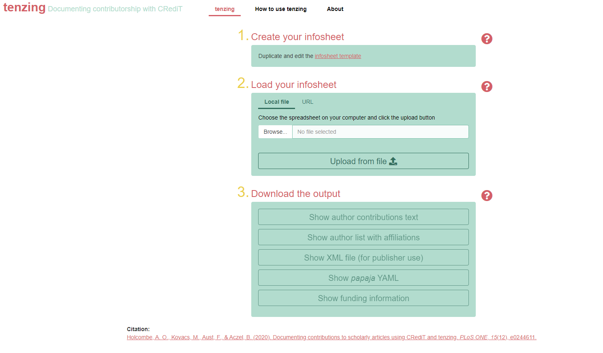
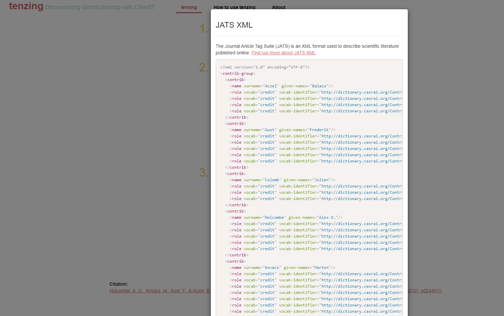

```{r, include = FALSE}
options(rmarkdown.html_vignette.check_title = FALSE)
knitr::opts_chunk$set(
  collapse = TRUE,
  comment = "#>"
)
```

The `tenzing` package can be used as a shiny application, which is already embedded in a webpage: [https://tenzing.club/](https://tenzing.club/). When you first open the app it might take a few seconds for the page to load.

If you want to instead run the app locally from your computer, first you have to open R and install the `tenzing` package with the following code:

```{r, eval = FALSE}
# install.packages("devtools")
devtools::install_github("marton-balazs-kovacs/tenzing")
```

After the installation finishes, you can launch the app.

```{r, eval = FALSE}
tenzing::run_app()
```

# Overview of the app

When you open the app, you'll see instructions in the left yellow panel to guide you through the process of providing the input to generate the app's output: contributorship information using the CRediT taxonomy, in various formats.

```{r, echo = FALSE, out.width = "100%"}

```

# Create your contributors table

Enter all your credit information in a copy of the contributors table template linked in this panel. You can also reach it [HERE](https://docs.google.com/spreadsheets/d/1Gl0cwqN_nTsdFH9yhSvi9NypBfDCEhViGq4A3MnBrG8/edit?usp=sharing). The template is created as a Google spreadsheet. Make your own copy of it in your Google Drive by _File -> Make a copy_. This Google spreadsheet format allows easy sharing with your collaborators so they can optionally enter their contributorship information themselves. We suggest you create and fill out the contributors table template in the beginning of your project, as it helps the contributors to have an overview on what each member of the team does. The contributors table can be updated as the project progresses.

```{r, echo = FALSE, out.width = "100%"}
knitr::include_graphics('./contributors_table.png')
```

__Note:__ Required fields in the contributors table are, for each author, the firstname and surname columns and at least one affiliation. The order of authors column must be filled for each author with a unique value. You can add as many contributors as you like. 

If you hover your mouse over the CRediT taxonomy column names in the Google spreadsheet format, you can see the definition of each role. You can find out more about the roles at [http://credit.niso.org/](http://credit.niso.org/).

# Upload your contributors table

You can load you contributors table to `tenzing` by either uploading a local file from your computer or pasting the share URL of the Google spreasheet.

## Uploading a local file

Before uploading your contributors table to the app, first download it to your computer if you haven't already. Use _File -> Download_. The app can process any of three formats: csv, tsv or xlsx (xlsx can have multiple sheets, so be aware that only the first sheet will be used by the app).

```{r, echo = FALSE, out.width = "100%"}
knitr::include_graphics('./tenzing_error.png')
```

Another possibility is to load your contributors table by providing the share URL of the spreadsheet to the app.

## Loading contributors table by URL

When you load your contributors table by using the share URL of the Google spreadsheet do not forget to use the "Anyone with the link" share option, so `tenzing` has permission to read your spreadsheet.

## Validating the contributors table

On upload the app checks the validity of your contributors table, with feedback to help you find any problems in your contributors table. Warnings usually do not affect the generated outputs so you can ignore them, although they can highlight possible duplication in your contributors table. In case of an error, the app does not enable the output generating buttons until you fix the error.

If you want to look at your uploaded contributors table you can do that by clicking _"Review contributors table"_, and if needed, search or filter the contributors by any column.

# Download the output

By clicking on each of the four output options you will see a preview of the generated output in a different window. The loading of this window might take a few seconds depending on the number of contributors that you have. After the preview has loaded you can decide whether you want to download the file in doc format or instead copy-paste it.

Below are the output options:

## Create a human readable report of the contributions according to CRediT

You can choose to show the initials instead of full names by using the toggle switch. Also, you can list the contributions according to the CRediT roles or by the name of the contributor by using the other switch.

```{r, echo = FALSE, out.width = "100%"}
knitr::include_graphics('./human_readable_output.png')
```

## Create the contributors' affiliation page

`tenzing` allows multiple first authors. To include multiple first authors you should use 1 for each author in the contributors table's _Order in publication_ column. `tenzing` will automatically detect that multiple contributors are listed as first author and print an additional statement. In this statement, `tenzing` will include the name and email address of the corresponding author as well so do not forget to provide this information.

```{r, echo = FALSE, out.width = "100%"}
knitr::include_graphics('./contrib_affil_output.png')
```

## Create a JATS formatted XML document containing the contributors information

```{r, echo = FALSE, out.width = "100%"}

```

## Create a YAML document containing the contributors informtation

This output can be incorporated into manuscript created with the `papaja` package.

```{r, echo = FALSE, out.width = "100%"}
knitr::include_graphics('./yaml_output.png')
```

## Create funding acknowledgements section

This output lists each contributor and the name of the funding agency, or the specific grant as included in the _Funding_ column of the contributors table. You can choose to show the initials instead of full names by using the toggle switch.

```{r, echo = FALSE, out.width = "100%"}
knitr::include_graphics('./funding_output.png')
```